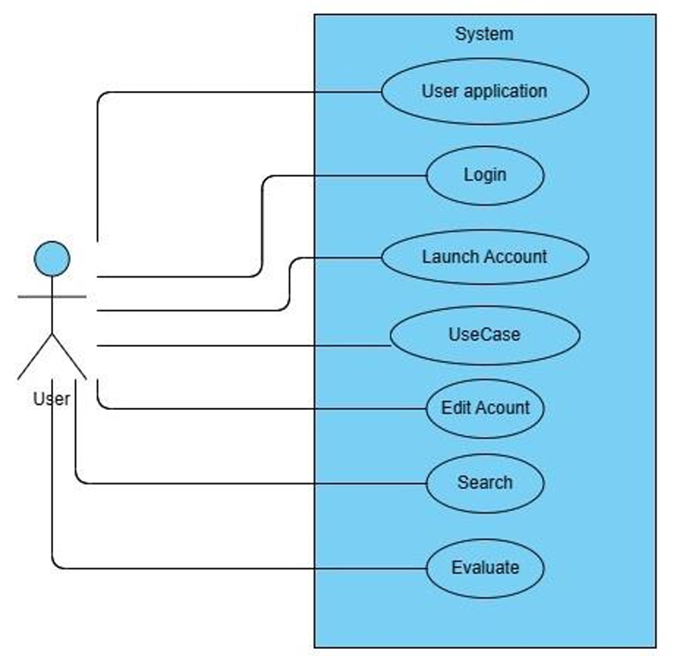
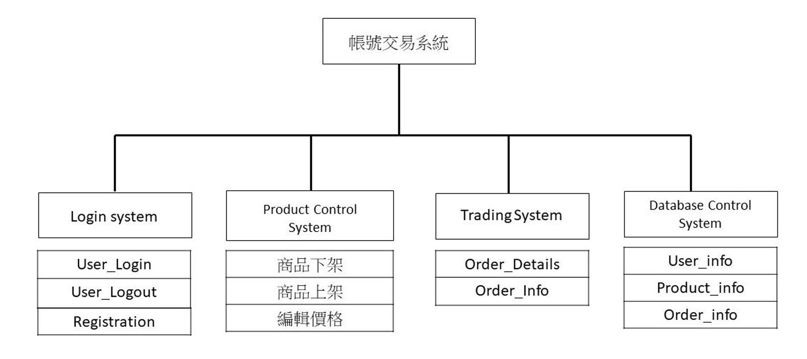
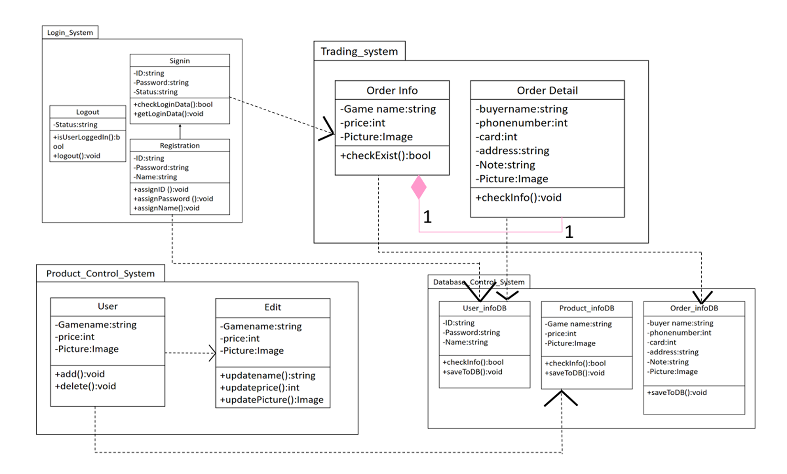
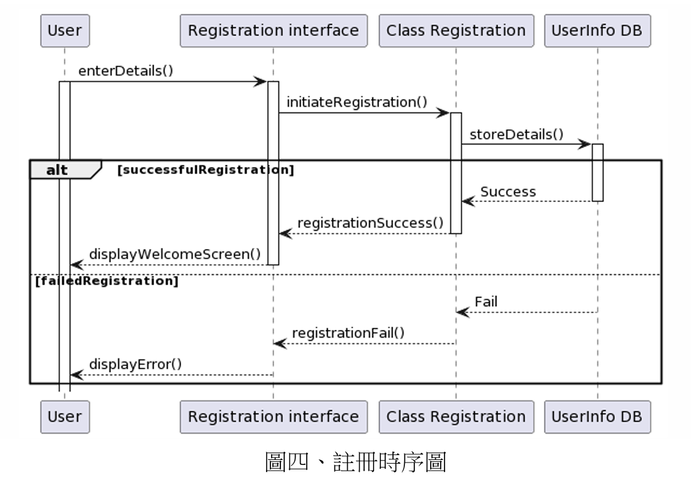

# 遊戲帳號交易平台 (Game Account Trading Platform)

這是一個基於軟體工程 (Software Engineering) 方法論開發的 Web 應用程式專案。本系統模擬了一個線上遊戲帳號交易平台，提供帳號買賣、估價與會員管理功能。

專案重點在於從需求分析 (OOA) 到物件導向設計 (OOD) 的完整實踐，並在前端環境下使用 Cookie/LocalStorage 模擬資料庫的 CRUD 行為。

---

## 專案簡介 (Project Overview)

本系統旨在解決玩家之間帳號交易與價值估算的需求。系統採用 **Client-Side Simulation** 架構，由三個主要子系統組成：
1.  **Login System**: 處理使用者註冊、登入與狀態管理。
2.  **Product Control System**: 處理商品的上架、編輯、下架與展示。
3.  **Trading System**: 處理訂單建立與交易流程。

> **⚠️ 注意**：本專案為學術/練習用途，主要展示前端邏輯與系統設計，並未串接真實金流與後端資料庫。

---

## 技術棧 (Tech Stack)

* **Frontend**: HTML5, CSS3, JavaScript (Vanilla JS & jQuery), Bootstrap 4.
* **Data Persistence**: **Cookie / LocalStorage** (用於模擬後端資料庫行為，實現無伺服器狀態下的資料存取)。
* **Design & Analysis**: UML (Use Case, Class, Sequence Diagrams).

---

## 核心功能 (Key Features)

### 1. 會員系統 (User System)
* **註冊與身分驗證**: 驗證帳號唯一性，並將使用者資料寫入模擬資料庫。
* **登入/登出狀態管理**: 維護使用者的 Session 狀態。

### 2. 商品管理系統 (Product Control)
* **商品上架 (Add)**: 賣家可上傳帳號圖片、設定名稱與價格。
* **編輯與更新 (Edit)**: 修改已上架商品的售價與資訊。
* **商品下架 (Delete)**: 從列表中移除商品。
* **即時互動**: 操作結果會即時反映在 DOM 元素上，無須重新整理頁面。

### 3. 交易與展示 (Trading & Display)
* **分類瀏覽**: 支援熱門遊戲（如怪物彈珠、Apex、神魔之塔）的帳號分類展示。
* **模擬下單**: 包含購物車邏輯與訂單資訊填寫 (訂購人、付款方式)。

---

## 系統設計 (System Design)

> **完整文件閱覽**
> 本專案包含完整的軟體工程規格書，詳細記錄了分析與設計過程，歡迎參閱：
> * [需求分析規格書 (OOA.pdf)](./docs/OOA.pdf)
> * [物件導向設計書 (OOD.pdf)](./docs/OOD.pdf)

本專案遵循嚴謹的軟體工程開發流程，從需求分析到詳細設計皆有完整文檔支持。

### 1. Object-Oriented Analysis (OOA)
在需求分析階段，我們定義了系統邊界與使用者互動流程。


> **圖一：使用案例圖 (Use Case Diagram)**
> 展示了 User 與系統各功能模組（Login, Search, Edit Account, Evaluate 等）的互動關係。

### 2. Object-Oriented Design (OOD)
在設計階段，我們將系統模組化，並定義了類別之間的關係與互動時序。

#### 2.1 系統架構 (System Architecture)
系統被拆解為四個主要模組：Login System, Product Control System, Trading System 與 Database Control System。


> **圖二：系統功能架構圖**
> 詳列了各子系統的功能職責。

#### 2.2 類別設計 (Class Design)
我們設計了以下核心類別來處理業務邏輯：
* `Registration` / `SignIn`: 處理驗證邏輯。
* `User` / `Product`: 定義資料模型與屬性。
* `OrderInfo` / `OrderDetail`: 處理交易資料。


> **圖三：類別圖 (Class Diagram)**
> 展示了系統中各類別的屬性、方法及其繼承與關聯關係。

#### 2.3 互動時序 (Sequence Diagrams)
為了確保邏輯正確，我們繪製了時序圖來規範資料流向。


> **圖四：註冊時序圖 (Sequence Diagram)**
> 展示了 User, Interface, Controller 與 Database 之間的訊息傳遞流程。

---

## 檔案結構 (File Structure)

```text
Game_Account_Trading/
│
├── index.html        # 首頁 (輪播、熱門商品、關於我們)
├── detail.html       # 交易中心 (商品管理 CRUD、下單介面)
├── login.html        # 會員入口 (登入與註冊邏輯)
│
├── docs/             # 系統設計文件 (包含 OOA.pdf, OOD.pdf 與 UML 架構圖)
├── css/              # 樣式表 (包含 Bootstrap 與自定義樣式)
├── js/               # 核心邏輯 (包含 Cookie 操作與 DOM 控制)
├── img/              # 圖片素材
└── lib/              # 第三方套件 (OwlCarousel, Tempusdominus 等)
```

## 聲明與致謝 (Credits & Disclaimer)

本專案在實作過程中參考了以下資源，特此致謝：

* **UI Template**:
  本專案的前端介面 (HTML/CSS) 改編自 **HTML Codex** 所設計的 **"ROYAL CARS"** (Free Car Rental HTML Template)。
  * **Designed by**: [HTML Codex](https://htmlcodex.com)
  * **Original Theme**: [Royal Cars](https://htmlcodex.com/car-rental-html-template/)
  * *註：本專案保留了原模板的響應式佈局與美學風格，並針對「遊戲帳號交易」的使用情境進行了大量的 DOM 結構修改與客製化。*

* **Core Logic**:
  所有的 JavaScript 業務邏輯、Cookie 資料模擬層 (Mock Database)、以及上述的 OOA/OOD 系統架構設計皆為原創實作。

* **Images**:
  專案中使用的遊戲截圖與素材僅供學術展示用途，版權歸原遊戲公司所有。